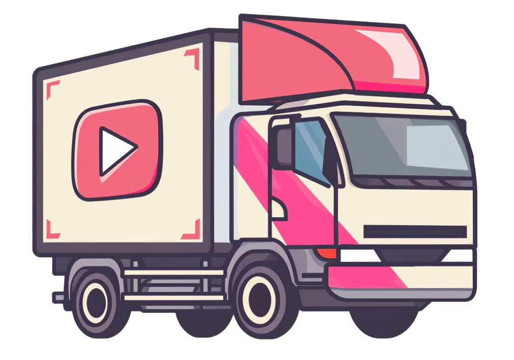

# Truckload

Moving your video collection with ease

## How to use

### Start development server

`yarn dev`

### Run local Inngest server

`npx inngest-cli@latest dev`

### Run partykit server

`cd app && npx partykit dev`

## Resources

- [AWS SDK v3 API reference](https://docs.aws.amazon.com/AWSJavaScriptSDK/v3/latest/client/s3/)
- [Mux API reference](https://docs.mux.com/api-reference)
