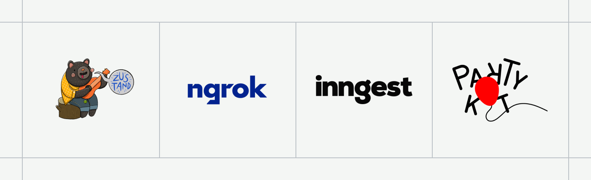
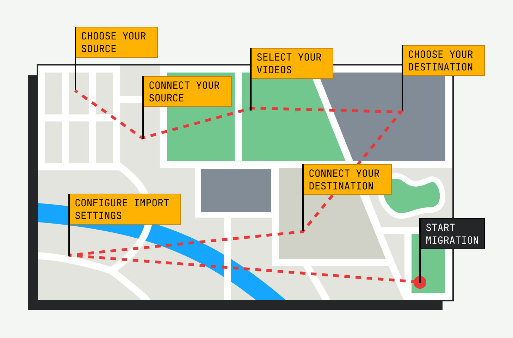

# Truckload

Migrate your video collection to a new platform with ease.

## Getting started

First, clone the repository and install dependencies:

```bash
git clone https://github.com/muxinc/truckload.git
cd truckload
npm install
```

Next, create a `.env.local` file in the root directory with your API keys and other configuration settings:

```bash
cp .env.example .env.local
```

Finally, start the app:

```bash
npm run start:dev
```

This will start server instances for the Next.js app, Inngest, PartyKit, and ngrok.



### About the Inngest server

[Inngest](https://www.inngest.com) makes serverless queues, background jobs, and workflows effortless. Truckload uses a [local Inngest development server](https://www.inngest.com/docs/local-development) to facilitate the loading and migrating of each video.

### About the PartyKit server

[PartyKit](https://www.partykit.io/) is a comprehensive solution for real-time sync within your application.

In this app, we're really only using it to receive status updates from the video migration background jobs and destination webhooks. Truckload uses a local PartyKit server on port `1999` to receive these notifications and pipe them back to the front-end for status updates.

## How it works

Truckload uses a simple workflow to migrate videos from one platform to another. Here's a high-level overview of the process:



## Authentication requirements

When using this app to migrate videos to a new platform, you'll need to authenticate with both the source and destination services to ensure that you have the necessary permissions to perform the desired actions (e.g. fetching video metadata, creating master files, uploading videos, etc.)

Here's a list of the authentication requirements for each service:

| Provider          | Requirements                                                                                                                                           | Resources                                                                                |
| ----------------- | ------------------------------------------------------------------------------------------------------------------------------------------------------ | ---------------------------------------------------------------------------------------- |
| Amazon S3         | [Access Key and Secret](https://docs.aws.amazon.com/general/latest/gr/aws-sec-cred-types.html#access-keys-and-secret-access-keys), bucket name, region | [AWS SDK v3 API docs](https://docs.aws.amazon.com/AWSJavaScriptSDK/v3/latest/client/s3/) |
| Api.video         | [API Key](https://docs.api.video/reference/basic-authentication)                                                                                       | [API docs](https://docs.api.video/reference)                                             |
| Cloudflare Stream | [API Token](https://dash.cloudflare.com/profile/api-tokens), Account ID                                                                                | [API docs](https://developers.cloudflare.com/stream/)                                    |
| Mux               | [Token ID and Secret](https://docs.mux.com/core/make-api-requests#http-basic-auth)                                                                     | [API docs](https://docs.mux.com/api-reference)                                           |

## Handling webhooks

Some destinations (like [Mux](https://mux.com?utm_source=github&utm_medium=readme&utm_campaign=truckload)) use webhooks to communicate migration progress to your application.

This presents a challenge when you're running this app locally, as you'll need a public URL that can
be reached by an HTTP request issued by your destination service.

To solve this, you can stand up a free, publicly-accessible tunnel URL using ngrok. Here's how:

1. Visit https://ngrok.com
2. Sign in with your existing account or with GitHub
3. Follow the instructions to install and authenticate `ngrok` on your machine
4. Create an `ngrok` endpoint for your local app by running `ngrok http http://localhost:3000`
5. Grab the resulting URL for use as your webhook destination, and append `/api/webhooks/[provider]`:


