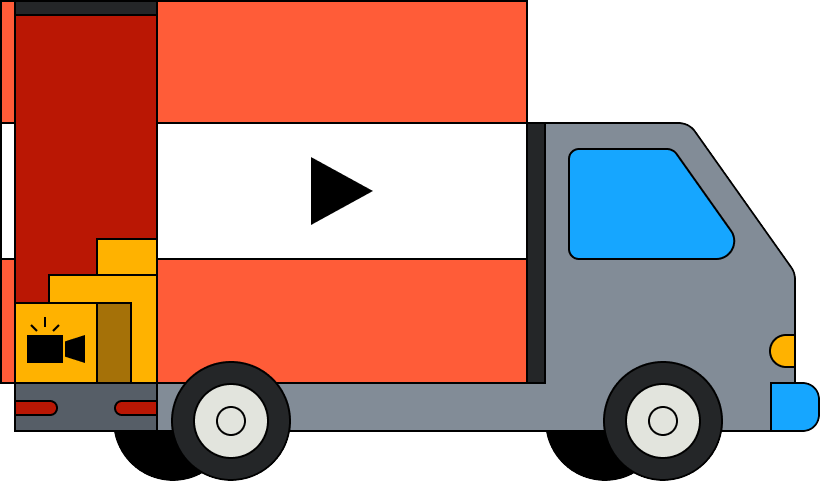
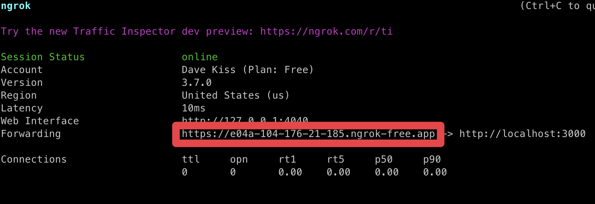

# Truckload

Migrate your video collection to a new platform with ease.

## How it works

### Start development server

`npm run start:dev`

This will start server instances for the Next.js app, Inngest, PartyKit, and ngrok.

## (optional) run servers independently

### Run local Inngest server

[Inngest](https://www.inngest.com) makes serverless queues, background jobs, and workflows effortless. Truckload uses Inngest to facilitate the loading and migrating of each video.

You can start a [local Inngest development server](https://www.inngest.com/docs/local-development) with the following command:

`npx --yes inngest-cli@latest dev`

### Run PartyKit server

[PartyKit](https://www.partykit.io/) is a comprehensive solution for real-time sync within your application.

In this app, we're really only using it to receive status updates from the video migration background jobs and destination webhooks.

To receive these notifications and pipe them back to the front-end for status updates, you need to start a PartyKit server locally.

`cd app && npx partykit dev`

PartyKit will spin up on port `1999`

## Handling webhooks

Some destinations (like Mux) use webhooks to communicate migration progress to your application.

This presents a challenge when you're running this app locally, as you'll need a public URL that can
be reached by an HTTP request issued by your destination service.

To solve this, you can stand up a free, publicly-accessible tunnel URL using ngrok. Here's how:

1. Visit https://ngrok.com
2. Sign in with your existing account or with GitHub
3. Follow the instructions to install and authenticate `ngrok` on your machine
4. Create an `ngrok` endpoint for your local app by running `ngrok http http://localhost:3000`
5. Grab the resulting URL for use as your webhook destination, and append `/api/webhooks/[provider]`:

## Authentication requirements

### Amazon S3

You'll need an [AWS Access Key and Secret](https://docs.aws.amazon.com/general/latest/gr/aws-sec-cred-types.html#access-keys-and-secret-access-keys) with read access to connect your account.

#### Bucket Name

This value can be found in the AWS console and is used to look up your S3 bucket.

#### Region

This value can be found in the AWS console and is used to look up your S3 bucket region.

### Api.video

You'll need an [Api.video API Key](https://docs.api.video/reference/basic-authentication) with write access to connect your account.

### Cloudflare Stream

You'll need an [API Token](https://dash.cloudflare.com/profile/api-tokens) with write access to connect your account.

#### Account ID

This value can be found in the dashboard sidebar and is used to look up your Stream account.

### Mux

You'll need an [Mux Token ID and Secret](https://docs.mux.com/core/make-api-requests#http-basic-auth) with write access to connect your account.

## Resources

- [Api.video API reference](https://docs.api.video/reference)
- [AWS SDK v3 API reference](https://docs.aws.amazon.com/AWSJavaScriptSDK/v3/latest/client/s3/)
- [Cloudflare Stream API reference](https://developers.cloudflare.com/stream/)
- [Mux API reference](https://docs.mux.com/api-reference)
