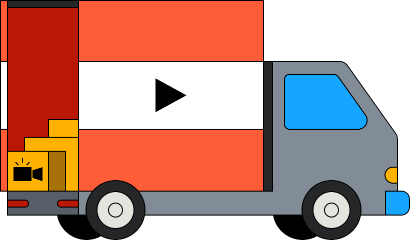
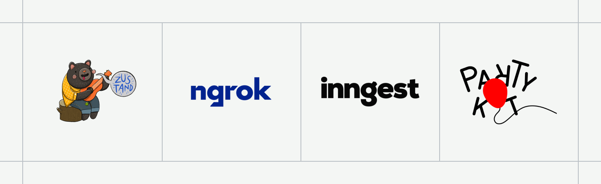
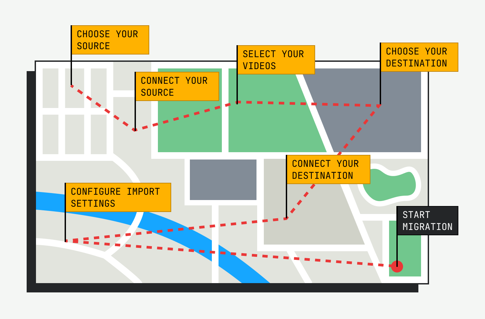

# Truckload

Migrate your video collection to a new platform with ease.

## Getting started

First, clone the repository and install dependencies:

```bash
git clone https://github.com/muxinc/truckload.git
cd truckload
npm install
```

Next, create a `.env.local` file in the root directory with your API keys and other configuration settings:

```bash
cp .env.example .env.local
```

Finally, start the app:

```bash
npm run start:dev
```

This will start server instances for the Next.js app and PartyKit.



### About Workflow

Truckload uses the [Vercel Workflow SDK](https://vercel.com/docs/workflow) to orchestrate video migration jobs. Workflows and steps are defined using `'use workflow'` and `'use step'` directives. In development, workflows run locally via the built-in workflow runtime.

### About the PartyKit server

[PartyKit](https://www.partykit.io/) is a comprehensive solution for real-time sync within your application.

In this app, we're using it to receive status updates from the video migration background jobs. Truckload uses a local PartyKit server on port `1999` to receive these notifications and pipe them back to the front-end for status updates.

## How it works

Truckload uses a simple workflow to migrate videos from one platform to another. Here's a high-level overview of the process:



## Authentication requirements

When using this app to migrate videos to a new platform, you'll need to authenticate with both the source and destination services to ensure that you have the necessary permissions to perform the desired actions (e.g. fetching video metadata, creating master files, uploading videos, etc.)

Here's a list of the authentication requirements for each service:

| Provider          | Requirements                                                                                                                                           | Resources                                                                                |
| ----------------- | ------------------------------------------------------------------------------------------------------------------------------------------------------ | ---------------------------------------------------------------------------------------- |
| Amazon S3         | [Access Key and Secret](https://docs.aws.amazon.com/general/latest/gr/aws-sec-cred-types.html#access-keys-and-secret-access-keys), bucket name, region | [AWS SDK v3 API docs](https://docs.aws.amazon.com/AWSJavaScriptSDK/v3/latest/client/s3/) |
| Api.video         | [API Key](https://docs.api.video/reference/basic-authentication)                                                                                       | [API docs](https://docs.api.video/reference)                                             |
| Cloudflare Stream | [API Token](https://dash.cloudflare.com/profile/api-tokens), Account ID                                                                                | [API docs](https://developers.cloudflare.com/stream/)                                    |
| Vimeo             | [Access Token](https://developer.vimeo.com/api/authentication#obtaining-an-access-token)                                                               | [API docs](https://developer.vimeo.com/api/)                                             |
| Mux               | [Token ID and Secret](https://docs.mux.com/core/make-api-requests#http-basic-auth)                                                                     | [API docs](https://docs.mux.com/api-reference)                                           |

## How asset status is tracked

After transferring a video to Mux, the workflow polls the Mux API until the asset status is `ready` (or `errored`). This eliminates the need for webhooks and ngrok tunnels during local development.
